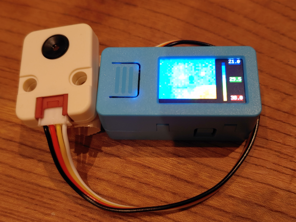
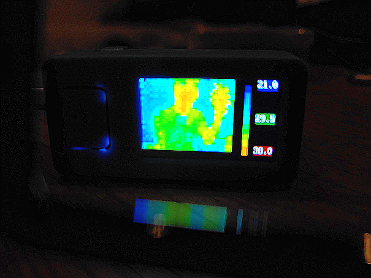

# MaixPy MLX90640 sensor class using I2C

The C++ example codes in [THERMAL_MLX90640](https://github.com/m5stack/M5Stack/tree/master/examples/Unit/THERMAL_MLX90640) are ported for MaixPy.  
The *MLX90640sensor* class can capture temperature images from MLX90640 using I2C on python.  
It enables M5StickV to run MLX90640 module directly on MaixPy as well as sensor class. So it can connect with KPU processing.  
```
mlx = MLX90640sensor()
coltbl = mlx.create_color_table()
while True:
    img = mlx.snapshot( coltbl )
    lcd.display( img )
```

  
  

## Issues
* Slower than C++ codes.
* Because upper subpage and lower subpage are not synchoronized, moving objects look blurry.
* It is easy to cause out of memory. It should be removed to call mlx.draw_colorbar().
